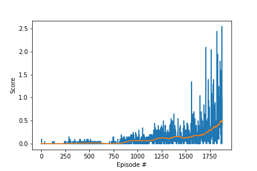

# Learning Algorithm
In this implementation we used the DDPG algorithm [DDPG](https://arxiv.org/pdf/1509.02971.pdf) to triain the agent to play Tennis.

* [model.py](model.py) file contains neural network architecture for actor and critic models
* [ddpg_agent.py](ddpg_agent.py) file implements Agent and ReplayBuffer classes
* [checkpoint_actor.pth](checkpoint_actor.pth) file contains model checkpoint for actor neural network
* [checkpoint_critic.pth](checkpoint_critic.pth) file contains model checkpoint for critic neural network

Hyperparameters (defined in ddpg_agent.py)

* BUFFER_SIZE = int(1e5)  (replay buffer size)
* BATCH_SIZE = 128        (minibatch size)
* GAMMA = 0.99            (discount factor)
* TAU = 1e-3              (for soft update of target parameters)
* LR_ACTOR = 1e-4         (learning rate of the actor)
* LR_CRITIC = 1e-4        (learning rate of the critic)
* WEIGHT_DECAY = 0        (L2 weight decay)
* UPDATE_EVERY = 1        (how many steps to take before updating target networks)

### Actor neural network

* The Actor neural network consists of three fully connected (FC) layers.
* The input has 24 channels (each agent observes a state with length: 24)
* The output channels of the first FC layer is: 256
* The input and output channels of the second FC layer are: 256, 128
* The input channels of the third FC layer are: 128
* The output has 2 channels (actions: movement toward (or away from) the net, and jumping)

### Critic neural network

* The Critic neural network consists of three fully connected (FC) layers.
* The input has 24 channels (each agent observes a state with length: 24)
* The output channels of the first FC layer is: 256
* The input channels of the second FC layer is: 256 + 2 (actions)
* The output channels of the second FC layer is: 128
* The output has 1 channel

# Plot of Rewards

DDPG took 1880 episodes to solve the environment!


```
Episode 100	Average Score: -0.003	Score: -0.005
Episode 200	Average Score: -0.003	Score: -0.005
Episode 300	Average Score: 0.001	Score: -0.0055
Episode 400	Average Score: 0.004	Score: -0.005
Episode 500	Average Score: 0.011	Score: -0.005
Episode 600	Average Score: 0.012	Score: 0.0455
Episode 700	Average Score: -0.002	Score: -0.005
Episode 800	Average Score: 0.006	Score: -0.0055
Episode 900	Average Score: 0.044	Score: 0.0455
Episode 1000	Average Score: 0.063	Score: 0.045
Episode 1100	Average Score: 0.063	Score: -0.005
Episode 1200	Average Score: 0.106	Score: 0.0955
Episode 1300	Average Score: 0.115	Score: 0.1455
Episode 1400	Average Score: 0.153	Score: 0.0455
Episode 1500	Average Score: 0.123	Score: 0.2455
Episode 1600	Average Score: 0.174	Score: 0.0955
Episode 1700	Average Score: 0.212	Score: 0.0955
Episode 1800	Average Score: 0.361	Score: 0.1955
Episode 1880	Average Score: 0.502	Score: 0.3955
Environment solved in 1880 episodes!
```



# Improvements

* As future improvements, I would like to implement [Distributed Distributional Deterministic Policy Gradients (D4PG)](https://openreview.net/forum?id=SyZipzbCb) algorithm and compare its performance with the current impelmentation of DDPG in playing the Tennis environment.